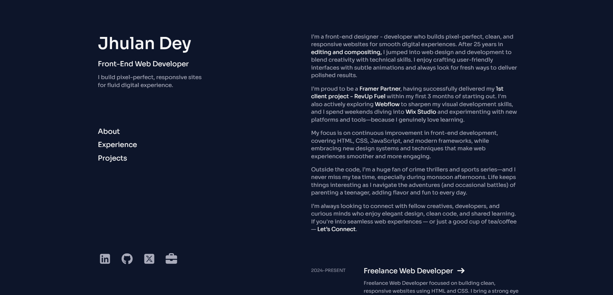
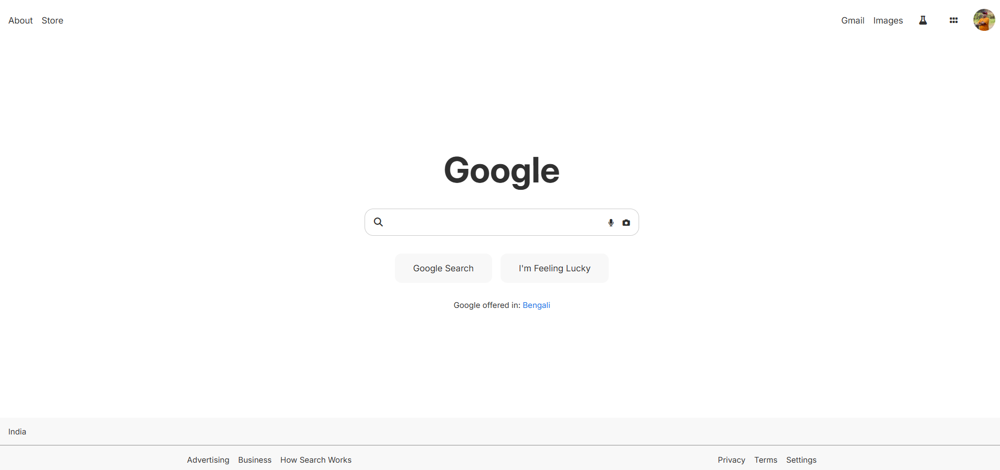

### <h1>👋 Hello World! — I'm Jhulan Dey</h1>

### Really glad to see you drop by!

I’m a self-taught Webflow and Framer developer, currently diving deeper into the world of front-end web technologies out of pure curiosity.

After years of building visually polished sites with no-code tools, I felt a strong urge to understand what happens under the hood. That curiosity led me back to the basics—HTML, CSS, JavaScript—and the challenges that come with real web development.

I enjoy solving problems, learning in public, and crafting digital experiences that feel as good as they look.
tch.

🌍 <strong>Location</strong> – India 🇮🇳  
🖥️ <strong>Portfolio</strong> – <a href="https://jd-portfolio-demo.netlify.app/">jd-portfolio-demo.netlify.app</a>  
✉️ <strong>Reach me</strong> – <a href="mailto:jhulandey@gmail.com">jhulandey@gmail.com</a> 
🧠 <strong>Currently Learning</strong> – Webflow and JavaScript   
⚡ <em>"Enjoying the process so far. Never thought I will."</em> — CodeJD

## 📈 My GitHub Stats:

<table>
  <tr>
    <td>
      
    </td>
    <td>
      
    </td>
  </tr>
</table>

---
<h2>🛠️ Tools & Technologies</h2>

 <table cellpadding="40"> <tr> <td align="left"><strong>👨‍💻 Programming Languages</strong></td> <td align="right"> &nbsp;&nbsp;  </td> </tr> <tr> <td align="left"><strong>🧱 Frontend Technologies</strong></td> <td align="right"> &nbsp;&nbsp;  </td> </tr> <tr> <td align="left"><strong>🛠 Code Editors</strong></td> <td align="right">  </td> </tr> <tr> <td align="left"><strong>🎨 Design & No-Code Tools</strong></td> <td align="right"> &nbsp;&nbsp; &nbsp;&nbsp; &nbsp;&nbsp;  </td> </tr> <tr> <td align="left"><strong>🎬 Video & Motion Graphics</strong></td> <td align="right"> &nbsp;&nbsp; &nbsp;&nbsp;  </td> </tr> <tr> <td align="left"><strong>🗃️ Databases & Analytics</strong></td> <td align="right"> &nbsp;&nbsp; &nbsp;&nbsp; &nbsp;&nbsp;  </td> </tr> </table> 

---

## ✨ What I’ve Built So Far

### 🧱 My First Portfolio — Built from Scratch  
> “No templates. No frameworks. Just me, VS Code, and two weekends.”

This was my first real HTML & CSS project where I wrote every line myself.  
- I structured the layout using semantic HTML tags and styled it with clean CSS.  
- Learned about spacing, padding, responsive sections, and Sora font integration.  
- The site includes an intro, work showcase, and contact section.  
- Deployed via **Netlify** — which made going live feel magical.

🔗 [Live Site](https://jd-portfolio-demo.netlify.app/)
🔗 [GitHub Repo](https://github.com/JhulanD/ultimate-html-css-portfolio)

---

### 🧪 Google Homepage Clone — Rebuilding a Classic  
> “Every `
`, `<input>`, `<class>` felt like a mini‑masterclass.”

  

I challenged myself to recreate Google.com using just HTML & CSS:
- Used `position`, `margin`, `padding`, and flexbox to align elements.
- Styled the search bar, buttons, footer, and minimal branding elements.
- Made it pixel-close without using any frameworks.
- This helped me deeply understand layout and browser rendering.

🔗 [Live Preview](https://lnkd.in/gw_2ACkN)

---

### 🎯 Flexbox Mini Projects — CSS in Action  
> “Flexbox helped structure things. Absolute positioning brought balance.”

Built 3 small landing-page style UIs using only HTML & CSS:  
- Practiced vertical text scrolling using animations.  
- Added image overlays for text contrast.  
- Learned how to center content with `justify-content` and `align-items`.  
- Used `z-index`, `position: absolute`, and responsive media queries.

These projects were based on starter tasks from **Sheryians Coding School**.

🔗 [GitHub Repo](https://lnkd.in/gVraU9dq)

---

---

## 📜 Certifications

### 🎓 Introduction to Front-End Development by Meta (Coursera)

> “It’s a small milestone, but one that reflects the discipline and passion it takes to grow in this field.”

  

I completed Meta’s **Introduction to Front-End Development** course on Coursera, which helped clarify key foundational concepts:
- 🔍 How the web works (HTML, CSS, JavaScript basics)
- 🗂️ File structuring, browser rendering, and accessibility
- 🛠️ Developer tools like Git, GitHub, browser DevTools
- 🗺️ Roadmap for front-end career progression

📄 [View Certificate (PDF)](public/Coursera%208SV9FX571MXA.pdf)

---

### 🧰 Learning HTML All Over Again — 20 Years Later  
> “I started with Dreamweaver 20 years ago. Now I’m learning HTML like it’s brand new.”

I completed a YouTube tutorial titled **HTML Full Course – Web Development for Beginners** (James McArthur).  
Even though it was 2.5 hours long, I took two days to go through it, pausing to code along with each topic.

- Built small sections after every lesson
- Learned about tags, nesting, accessibility, form fields
- Made a basic multi-section landing page

🔗 [Tutorial Link](https://lnkd.in/gNBcp4qB)

---

## 🧰 Skills So Far

---

## 💬 Why This Repo Exists

This isn’t a showcase. It’s a **public logbook** of my transition from no-code to real code.

Every project here is a building block toward becoming a front-end developer.  
I believe in learning in public — and in keeping things real, messy, and human.

---

> _"Enjoying the process so far. Never thought I will."_  
— CodeJD
