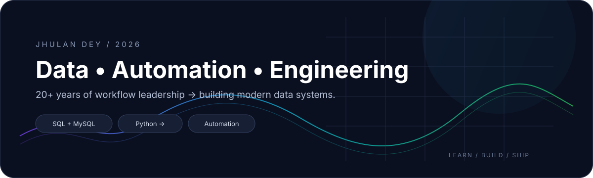

<div align="center">



### `DATA ENGINEERING • AUTOMATION • ANALYTICS`

<a href="https://www.linkedin.com/in/jhulandey/">LinkedIn</a>
&nbsp;·&nbsp;
<a href="https://jd-portfolio-demo.netlify.app/">Portfolio</a>
&nbsp;·&nbsp;
<a href="https://github.com/JhulanD">GitHub</a>
&nbsp;·&nbsp;
<a href="mailto:jhulandey.now@outlook.in">Email</a>

</div>

---

<table>
<tr>
<td width="58%" valign="top">

## About

I'm **Jhulan Dey** — a career changer moving from **20+ years of media operations and production workflows** into data engineering.

I like building systems that make messy work **structured, repeatable and measurable**.

Currently focused on:

`Python` · `SQL` · `Data Modeling` · `ETL/ELT` · `APIs` · `Git`

</td>
<td width="42%" valign="top">

## Now

**Applied Scale Intelligence**  
AI Automation · 2026 → Present

**Learning next**

`Pandas`  
`Cloud`  
`PySpark`  
`Airflow`  
`dbt`

</td>
</tr>
</table>

---

## The stack

**Data**

`SQL` `MySQL` `PostgreSQL` `Excel`

**Analytics**

`Power BI` `Tableau` `Data Cleaning` `Reporting`

**Automation**

`Make.com` `n8n` `APIs` `Workflow Design`

**Engineering**

`Python →` `Git/GitHub →` `ETL/ELT →` `Cloud`

---

## What I bring

```text
20+ years of production workflows
          ↓
process design + quality control
          ↓
automation + SQL + analytics
          ↓
Python + data engineering
```

I’m not starting my career from scratch — **I’m transferring systems thinking into a new technical domain.**

---

## Selected work

| Project | What it shows |
|---|---|
| **Automation Workflows** | API integrations, data movement, routing & operational reporting |
| **HTML/CSS Portfolio** | Built from scratch, responsive layout & deployment |
| **Google Homepage Recreation** | Layout, browser rendering & CSS fundamentals |

→ [Portfolio](https://jd-portfolio-demo.netlify.app/) · [GitHub](https://github.com/JhulanD)

---

## Learning in public

```text
SQL / MySQL             ████████████████████  solid
Analytics / BI          ████████████████████  solid
Automation / APIs       █████████████████░░░  hands-on
Python                  ███████████░░░░░░░░░  building
Data Engineering        ██████░░░░░░░░░░░░░░  next
Cloud / Spark / dbt     ██░░░░░░░░░░░░░░░░░░  upcoming
```

No tool collecting.  
**Learn → build → break → debug → repeat.**

---

<div align="center">

### `Interested in data, automation or building better workflows?`

<a href="mailto:jhulandey.now@outlook.in">Let's connect →</a>

<br><br>

<sub>Currently based in West Bengal, India · Open to entry-level data / analytics opportunities</sub>

</div>
